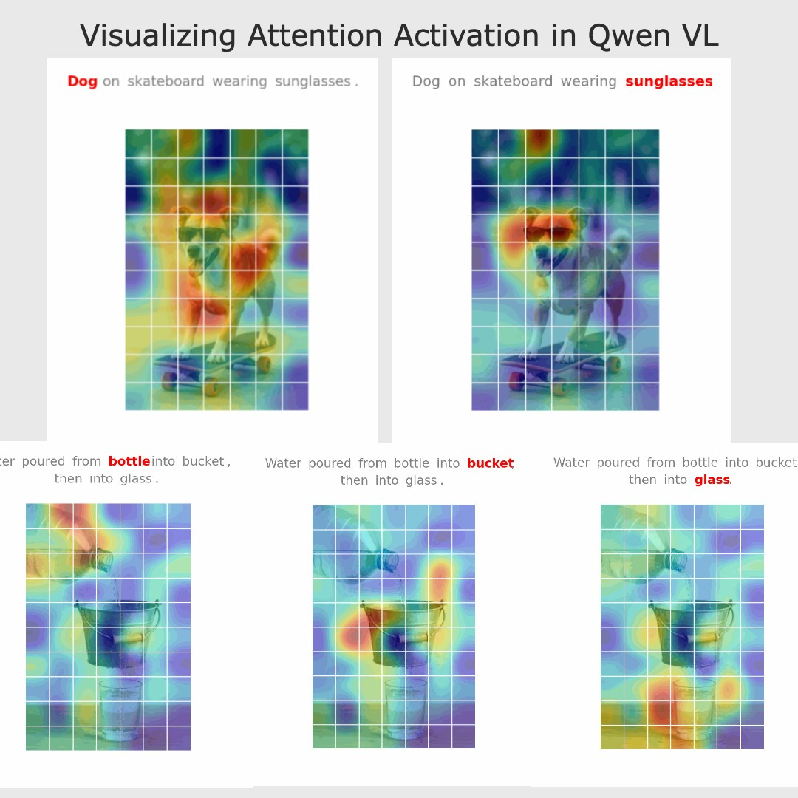
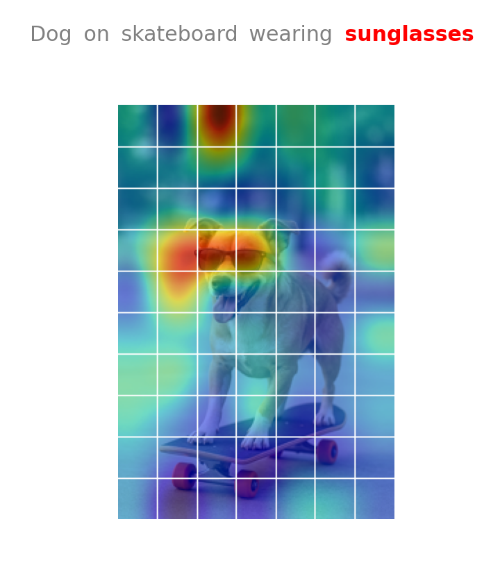
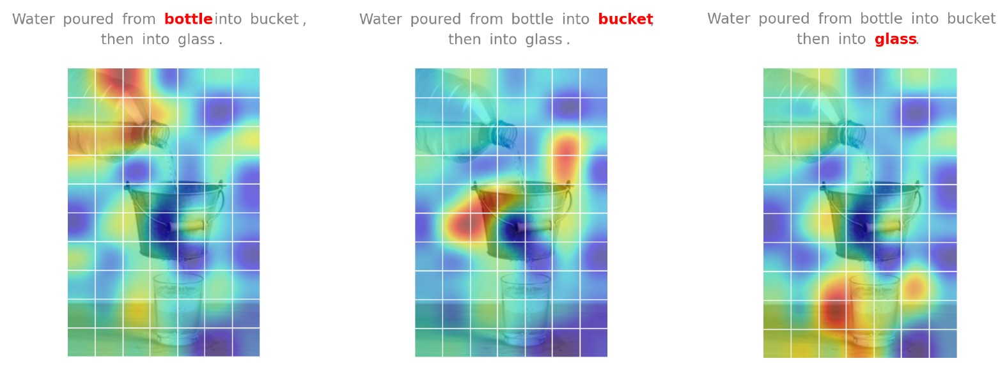
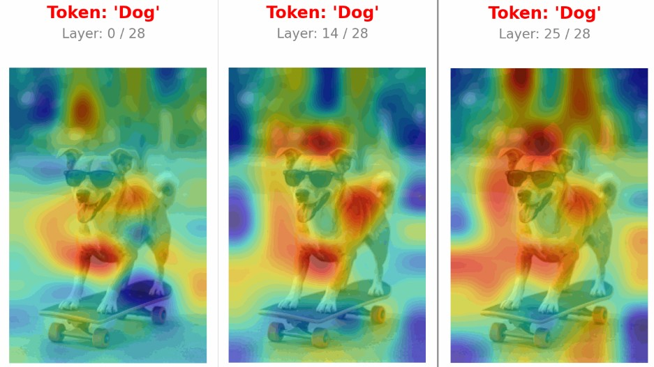

# 📘 Vision-Language Model Attention Visualization

### *Visualizing how Qwen3-VL attends to image regions during caption generation*

---


# 🎯 Overview

This project provides a complete pipeline for **interpreting how a Vision-Language Model (Qwen3-VL)** grounds each generated text token in the visual input. It extracts hidden states from all transformer layers, compares them against the image’s patch embeddings, and produces animated heatmaps that reveal **which image regions influenced each word**.

We compare embeddings of the image patches with the token's attention (attention_layer[token]) and overlay this score on a hetmap 


The resulting GIFs help uncover the internal reasoning process of multimodal LLMs.

# 🌟 Example Outputs

### **Word token Attention vs patch embeddings - Similarity **






### **Per-Token Evolution (A Single Token Across Layers)**



---

# 🧠 Motivation

Modern Vision-Language Models perform impressive captioning and reasoning—but the process by which they connect **words** to **image regions** is usually hidden.

The goals of this project are:

### ✔ **To understand grounding**

Which image patches contribute to the generation of each word?

### ✔ **To inspect token-by-token visual influence**

When the model says “cat,” where in the image is that concept coming from?

### ✔ **To visualize cross-modal fusion over depth**

How does grounding sharpen or evolve across the transformer layers?

### ✔ **To build interpretability tools for multimodal LLMs**

Providing insight into why a model produces certain outputs—and how it attends to visual structure.

This README explains both **why** this method works and **how** the analysis pipeline is implemented.

---

# 🧩 How Vision-Language Models Encode Images and Text

## 1. Image → Patches → Visual Tokens

The image is split into fixed-size patches (e.g., 16×16).


The vision encoder converts each patch into an embedding vector:

```
Patch P1 → v1
Patch P2 → v2
...
Patch PN → vN
```

These vectors become **visual tokens** in the same dimensional space as language embeddings.

```
┌───────────────────────────┐
│ Input Image               │
│ → Patches → Patch Embeds  │ → [v1, v2, ..., vN]
└───────────────────────────┘
```

---

## 2. Text → Token Embeddings

The text prompt (“Describe the image…”) is tokenized:

```
t1 = "Describe"
t2 = "the"
t3 = "image"
```

Each token receives an embedding vector:

```
e1, e2, ..., eM
```

---

## 3. Combined Sequence into Transformer

The model processes a *single multimodal sequence*:

```
[v1 v2 ... vN e1 e2 ... eM]
```

The transformer applies **self-attention** across *all* tokens—image and text.

---

## 4. What Self-Attention Compares

Each token generates three vectors:

* **Query vector** Q
* **Key vector** K
* **Value vector** V

Self-attention compares:

```
Q_i · K_j   for all tokens i, j
```

This includes:

* text ↔ text
* image ↔ image
* **text ↔ image** (critical for grounding)

When a text token (e.g., “cat”) attends to an image patch, the resulting hidden state incorporates the **Value** from that patch.

Thus a text hidden state becomes:

```
h("cat") = weighted combination of relevant image patches
```

Over many layers, the hidden state for “cat” becomes **semantically close** to the patches representing the cat in the image.

This is the reason cosine similarity works as a grounding signal.

---

# 🔍 What This Project Measures

The pipeline measures **semantic similarity** between:

### • the hidden vector for each generated text token

### • the visual embedding for each image patch

Using cosine similarity:

```
similarity(token t, patch i) = cos( h_t , v_i )
```

For each word, this produces a heatmap indicating:

> “How strongly does this token align with this image region?”

These heatmaps are rendered as GIFs that animate:

* All tokens across a single layer
* A single token across all layers (evolution)

---

# 🔧 How the Pipeline Works (Step-by-Step)

## **1. Load model + preprocess the image**

* Image is resized for efficiency
* Vision encoder performs patching and embedding
* Patch-grid dimensions are computed

---

## **2. Generate a caption (pass 1)**

A normal inference run:

```
model.generate()
```

captures:

* prompt length
* generated tokens
* full token sequence

This sequence is needed for the interpretability pass.

---

## **3. Extract hidden states for ALL transformer layers (pass 2)**

A second forward pass with:

```
output_hidden_states=True
```

returns hidden states for:

* embedding layer
* layer 1
* layer 2
* ...
* final layer

Each is shaped:

```
[1, sequence_length, hidden_dim]
```

---

## **4. Compute text-to-patch similarities**

For each layer:

* Take hidden states for **generated text tokens**
* Normalize vectors
* Compute cosine similarity with **each image patch embedding**
* Reshape similarities to patch grid size

This yields a 2D heatmap per token.

---

## **5. Visualize heatmaps**

Two types of animations are produced:

### **Per-Layer Attention GIFs**

All tokens displayed for a single layer.

### **Per-Token Evolution GIFs**

One token displayed across all layers.

### **Patch Grid Reference**

Shows the spatial layout of visual tokens.

---

# 🔥 Flow Diagram (Full Pipeline)

```
                IMAGE                           TEXT
                  │                               │
     Patches → Visual Encoder → [v1..vN]          │
                  │                               │
                  └───────────────┬───────────────┘
                                  ▼
          Combined Multimodal Sequence into Transformer
          ┌──────────────────────────────────────────────┐
          │ v1 v2 ... vN e1 e2 ... eM                    │
          └──────────────────────────────────────────────┘
                                  │
                          Self-Attention:
                compares Q_text ↔ K_patch and mixes V_patch
                                  │
     Hidden States per Layer: h_layer[k][token]
                                  │
         Cosine Similarity:  cos( h_token , v_patch )
                                  │
                Reshape → Patch Grid → Heatmaps → GIFs
```

---

# 📦 Output Files

```
layer_outputs/
   layer_00/image_layer_00_attention.gif
   layer_01/image_layer_01_attention.gif
   ...
token_evolution/
   token_00_word_layer_evolution.gif
   token_01_word_layer_evolution.gif
patch_grid_reference.png
```

---

# 🧪 Applications

* Vision-Language interpretability
* Understanding model grounding
* Debugging hallucinations
* Visual reasoning research
* Architecture comparison

---
